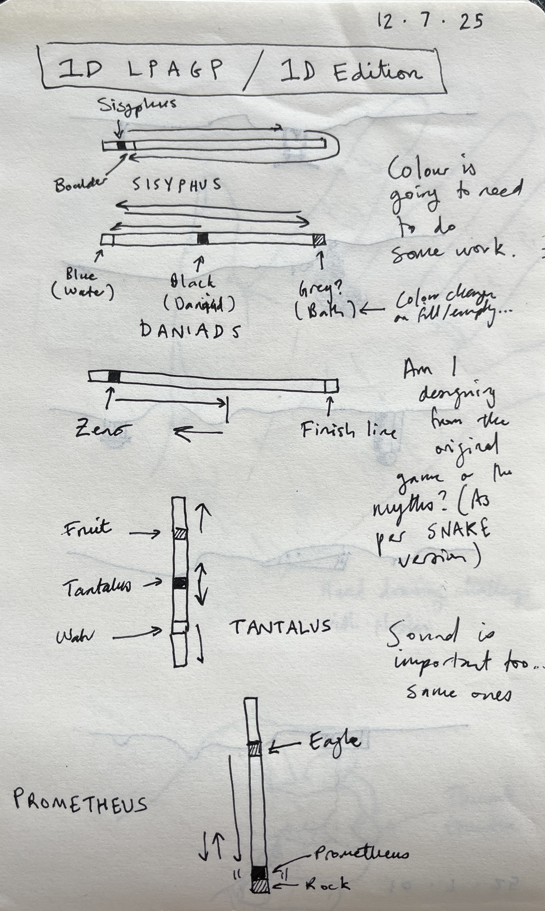
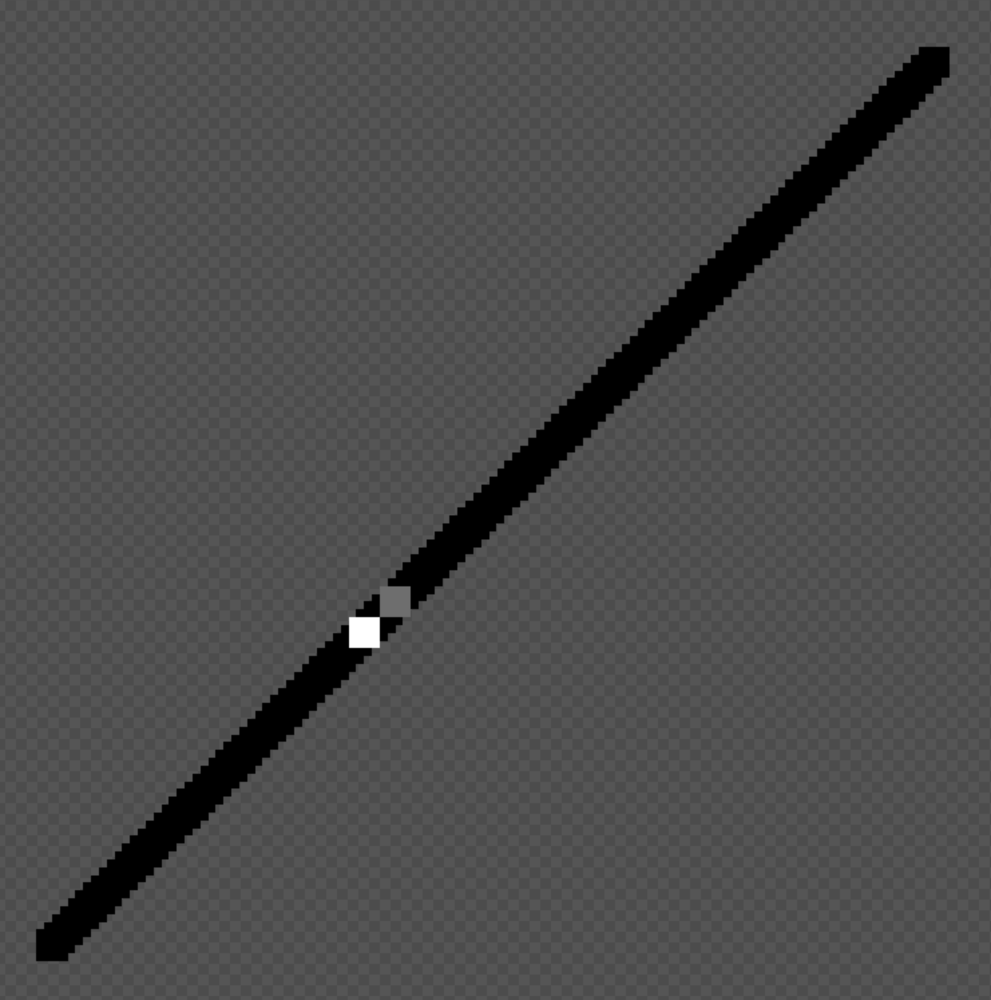
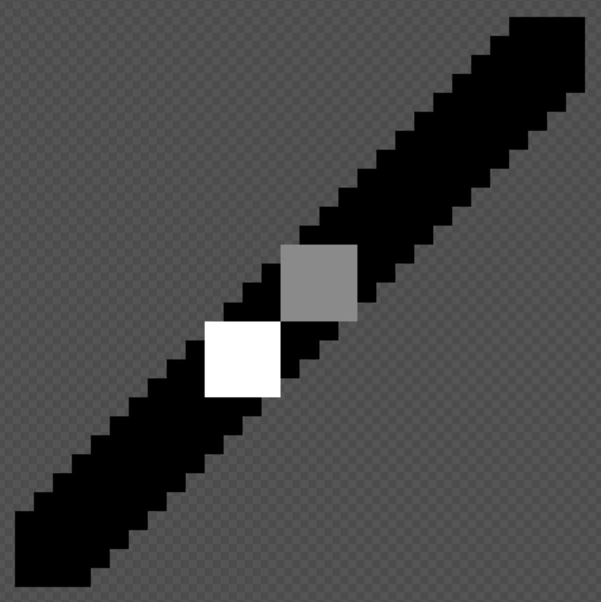
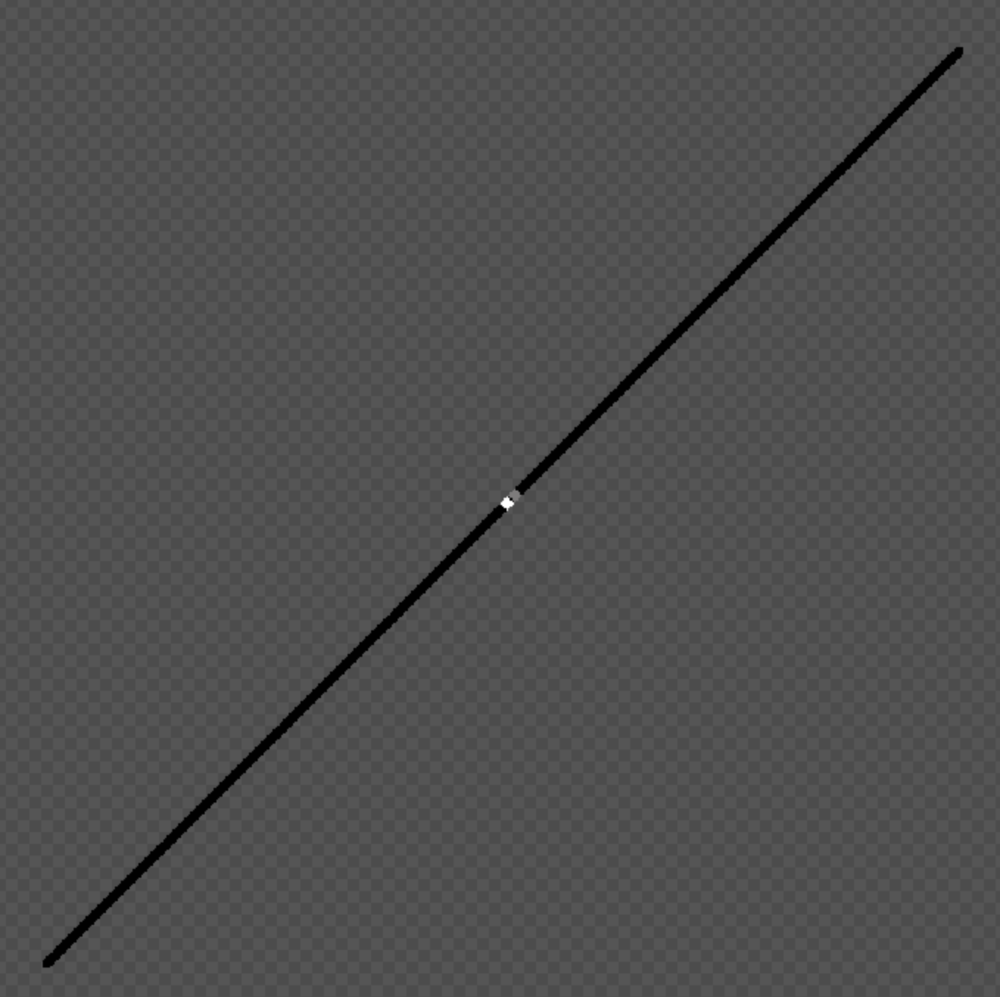
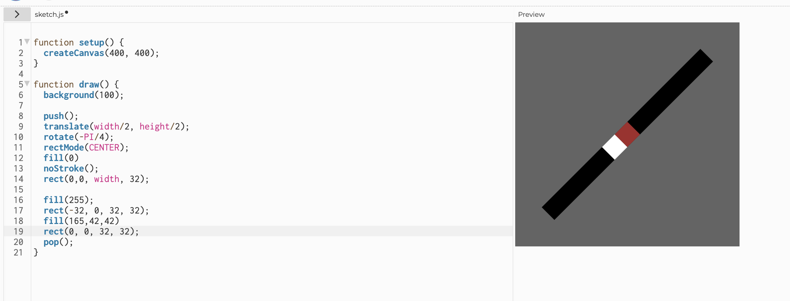
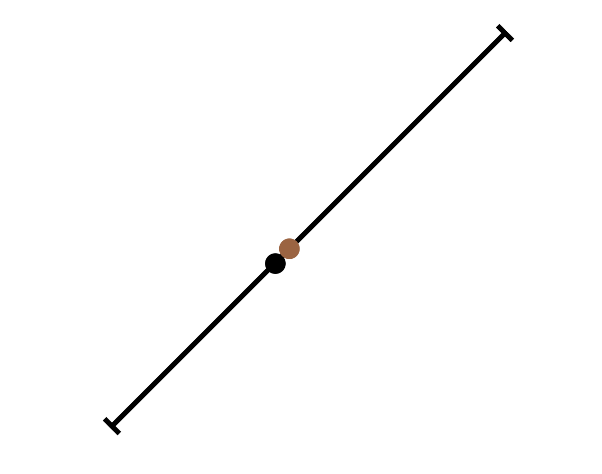

# Journal

## Initial sketches (2025-07-12)

## Getting started (2025-07-22)

Made the repo for this project today as it feels like I may just want to "quickly" make the game and move on from it? I'm seeing it as at least in part a chance to very quickly reintegrate p5 into my brain for my upcoming teaching in September.

But really it's such a simple idea there's maybe not going to be a million things to say? Though as in the sketches above, there will be some stuff around UI design and particularly the use of colour/alpha to communicate ideas.

I guess there's also going to be something in this about its referentiality to the previous games as well... the sense in which it's about recognition of a different game at extremely low resolution? I feel like that's such an internet/meme thing, the smallest recognizable resolution of the Girl with a Pearl Earring or whatever?

Anyway, getting started.

## A canvas, a road to Math (2025-08-27)

A mere month since my last entry eh? Steaming along. I've got the basic framework in place now, including some thrashing around to make the canvas responsive the way I wanted. Plenty of stupidity in there (see the commit messages) but I got it without too much hell.

Now that I have that and a basic skeleton of states it's time to just make one of these and see what happens. I've decided I'll start with Sisyphus since it's the classic, but it *instantly* raises a weird issue:

> What *orientation* should the line be in?

This is a 1D game, so the gameplay takes place on a line. A line can ... wait...

Well I was going to write that a line can be horizontal or vertical because I think I'm privileging... something about lines? Well maybe I'm privileging the idea of lines represented in pixels because that's the only way they appear perfectly smooth? But in fact a line can be in all kinds of orientations or whatever.

Such that the natural orientation of the Sisyphus Line (which is a fun thing to call it) would be a diagonal. However: how to represent that and how to say that it is a 1D line? One option is to have the line be one pixel wide, or even anti-aliased, such that it appears to be smooth... but then I wonder about how to show sisyphus and the boulder on that line?

Another option is a zoomed in version of the above, but then the line will be very "jagged" as we see the different "steps" of pixels that create it, which might make it feel like a 2D image?

This is also kind of getting at... what, the mathematical nature of a line? A line is an idea, not truly something that can be represented because any representation immediately has a second dimension, a thickness... so *whatever* you do your depiction of a line is two dimensional, so in that sense I shouldn't "mind" about it... except I do kind of mind.

There's a further thing involved in this, which has passed through my mind multiple times while thinking about this project off and on, which is the idea that the *game* is 1D already... there are always only "two ends" of the game that you can move towards or against... the idea that the real abstraction of the game (as I've already made it in the past) is a line... the boulder travels along that line, the eagle travels along that line, the danaid does, tantalus reaches up and down along that line, and zeno travels along that line...

So can you even make a 1D version? Maybe not in that sense. I'm ultimately talking more at the representational layer, and I suppose what I'm finding it that the game remains the same even distilled down like this. But there's a kind of "cultural desire" for the line to look a specific way.

You know what designers do in this situation? I hear that they prototype. So let's. Here are four goes at it.

So that's just the truly basic idea of zoomed in 1-pixel line on an angle. Jagged and all that. This is the one I thought I would end up feeling really uncomfortable with as "too 2D" but when I look at it my eyes read 1D in the end anyway because I'm comfortable with that idea of a representation of a line at very low resolution. So I'm actually much more okay with that than I thought I'd be... it's a clear option.

This one is unbelievably awkward, just a hard no. The thing it points out to me is the question of how you represent the "point" on the line... it feels like it probably should be either a "perfectly fitted square" or a circle? Both of these are of course ... what? The opposite of abstractions of the real imaginary 1D line? But there are cultural things to take into account... there's mathsy notation for example where I think you would show a point on a line as perhaps even a circle with a larger circumference than the line thickness? Like the point is not that the representation is as "close to 1D as possible" but rather than it communicates the idea/abstraction of 1D clearly. So more about clarify and symbolic representation than a matter of pixels.

Perhaps this is even more insanely gross than the previous one? Nah they're both horrible. Some thing... the points look just badly, badly wrong.

This one attempts to rectify that by it being more of a "rotation" of square "pixels" along that line... it sort of works. It makes me think I should make at least two more visual prototypes here, one that's literally p5 rotating a line with two squares on it (interestingly? p5 has a point() function which actually just draws a single pixel...) and one that's a more mathsy representation as above, with a thin line and a larger point to indicate that... so...

I think there's quite a lot to like about this one? But maybe it's still well worth pursuing the maths one...

Hmmm, this is maybe a bit of an embarrassment of riches. I'm starting to think the maths representation is the winner here in fact. It's very very weird. Very weird. Maybe they could even have little captions describing them as figures... "figure 1. Sisyphus"

Before I go though – I'm enthused by this idea though – one extra thought about sisyphus. To the extent it's on a 45º line, there's nowhere for the player to stand "away" from the boulder... it would always come to rest on top of them at the bottom, which means the player point and the boulder point will always be perfectly adjacent?

Unless I decide to fold in a little bit of character via animation? Like a sort of shoving movement? Could be hilarious to have this be the most "juicy" of the games in terms of representations? Worth considering and digging into more deeply.

I feel like the "Math!" thing here is the winner on the day. I'm persuaded right now, but let's see tomorrow.

## Math! (2025-08-28)

Today I was able to prototype a sisyphus-math version of the 1D idea and... it felt right. I'm not 100% sure it's what I thought I wanted at the beginning, given that I had pretty clear ideas around it being 1D as represented in pixel art in the tradition of the original game. Here I'm again running into this question of whether I'm adapting the previous game (or really just the original game) or I'm adapting the myth anew each time. I suppose the answer is "both" because it's not like I can escape design decisions I made in prior versions... nor do I want to, I want that family resemblance they have (I've been reading Bowers' paper on the logic of annotated portfolios), it's part of "the thing."

Re-reading the [why](./why.md) document suggests that I was open to what has happened, but it's pretty clear I was caught up in my original visual idea of a more block idea of one 1D would look like in a retro pixel game. My questions and interests are still supported by the math version I'm pursuing now, but they're just kind of... *better* supported by it?

And that's probably because... well math has solved this problem of representation already, the idea of representing a line, points along a line, these are all things that there are mathematical notations/diagramming for, and so to use those means to fall in line with a well-established and near-universal set of symbols. It also ends up giving me a kind of destination form that I didn't have outside the term "1D"... by specifically translating/adapting into the mathematical representation of lines and points, I get a bunch of stuff that I can then look to to try to create these adaptations. It may not have all the answers, but it provides a place to *look for them* which is huge. This is part of the bigger questions of "adaptation" that I think are so interesting for videogames. (And this could so easily be its own design-oriented book, eh.)

So I'm excited to pursue this... I made this gif which I think for me captures the excitement/"rightness" of this line of design:

It's just so fun. It reminds me a lot of the moment of doing sisyphus with the slider... there's just the pleasure of seeing something odd translated across into something you didn't think would tell that story. It's funny.

But there are questions! For instance... is that point just the boulder and you the player are pushing it (and are therefore sisyphus?). Is it sisyphus-and-the-boulder represented as a moving point on a line? Is it that there ought to be a *second* point representing the boulder (probably in a different colour?) and that they move together? If they move together is it in unison or is there some "juice" to sisyphus shoving the boulder upward, then catching up with it?

Something I like (but don't know if I'm ready to tackle) with that juice-line, is that there's this truly bizarre thing going on where I'm contemplating grappling with animation and realism in this game but not in any other, and this is the *most abstract* representation... and perhaps there's just a clarity to that in the end, that "of course" you would incorporate those things in this case... for humour, for legibility? Unsure. I think it's clear that the game would work as it is in the gif, but I do want to explore further.

(There's a line of thinking about the actual codebase and how to represent it efficiently, but for now I'm happy to just have a gif.)