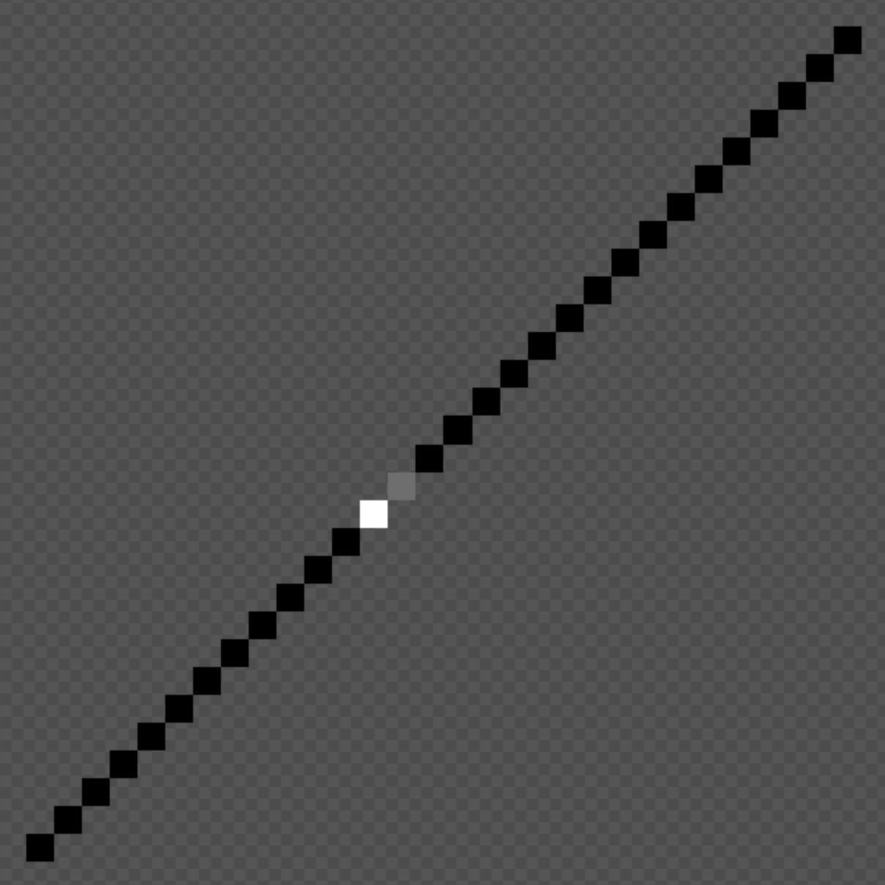
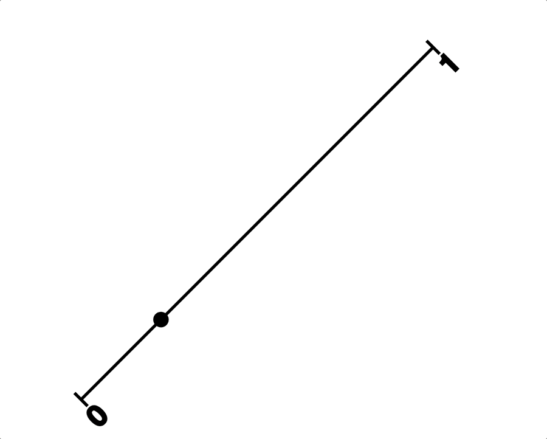

# Journal

## Initial sketches (2025-07-12)

## Getting started (2025-07-22)

Made the repo for this project today as it feels like I may just want to "quickly" make the game and move on from it? I'm seeing it as at least in part a chance to very quickly reintegrate p5 into my brain for my upcoming teaching in September.

But really it's such a simple idea there's maybe not going to be a million things to say? Though as in the sketches above, there will be some stuff around UI design and particularly the use of colour/alpha to communicate ideas.

I guess there's also going to be something in this about its referentiality to the previous games as well... the sense in which it's about recognition of a different game at extremely low resolution? I feel like that's such an internet/meme thing, the smallest recognizable resolution of the Girl with a Pearl Earring or whatever?

Anyway, getting started.

## A canvas, a road to Math (2025-08-27)

A mere month since my last entry eh? Steaming along. I've got the basic framework in place now, including some thrashing around to make the canvas responsive the way I wanted. Plenty of stupidity in there (see the commit messages) but I got it without too much hell.

Now that I have that and a basic skeleton of states it's time to just make one of these and see what happens. I've decided I'll start with Sisyphus since it's the classic, but it *instantly* raises a weird issue:

> What *orientation* should the line be in?

This is a 1D game, so the gameplay takes place on a line. A line can ... wait...

Well I was going to write that a line can be horizontal or vertical because I think I'm privileging... something about lines? Well maybe I'm privileging the idea of lines represented in pixels because that's the only way they appear perfectly smooth? But in fact a line can be in all kinds of orientations or whatever.

Such that the natural orientation of the Sisyphus Line (which is a fun thing to call it) would be a diagonal. However: how to represent that and how to say that it is a 1D line? One option is to have the line be one pixel wide, or even anti-aliased, such that it appears to be smooth... but then I wonder about how to show sisyphus and the boulder on that line?

Another option is a zoomed in version of the above, but then the line will be very "jagged" as we see the different "steps" of pixels that create it, which might make it feel like a 2D image?

This is also kind of getting at... what, the mathematical nature of a line? A line is an idea, not truly something that can be represented because any representation immediately has a second dimension, a thickness... so *whatever* you do your depiction of a line is two dimensional, so in that sense I shouldn't "mind" about it... except I do kind of mind.

There's a further thing involved in this, which has passed through my mind multiple times while thinking about this project off and on, which is the idea that the *game* is 1D already... there are always only "two ends" of the game that you can move towards or against... the idea that the real abstraction of the game (as I've already made it in the past) is a line... the boulder travels along that line, the eagle travels along that line, the danaid does, tantalus reaches up and down along that line, and zeno travels along that line...

So can you even make a 1D version? Maybe not in that sense. I'm ultimately talking more at the representational layer, and I suppose what I'm finding it that the game remains the same even distilled down like this. But there's a kind of "cultural desire" for the line to look a specific way.

You know what designers do in this situation? I hear that they prototype. So let's. Here are four goes at it.

So that's just the truly basic idea of zoomed in 1-pixel line on an angle. Jagged and all that. This is the one I thought I would end up feeling really uncomfortable with as "too 2D" but when I look at it my eyes read 1D in the end anyway because I'm comfortable with that idea of a representation of a line at very low resolution. So I'm actually much more okay with that than I thought I'd be... it's a clear option.

This one is unbelievably awkward, just a hard no. The thing it points out to me is the question of how you represent the "point" on the line... it feels like it probably should be either a "perfectly fitted square" or a circle? Both of these are of course ... what? The opposite of abstractions of the real imaginary 1D line? But there are cultural things to take into account... there's mathsy notation for example where I think you would show a point on a line as perhaps even a circle with a larger circumference than the line thickness? Like the point is not that the representation is as "close to 1D as possible" but rather than it communicates the idea/abstraction of 1D clearly. So more about clarify and symbolic representation than a matter of pixels.

Perhaps this is even more insanely gross than the previous one? Nah they're both horrible. Some thing... the points look just badly, badly wrong.

This one attempts to rectify that by it being more of a "rotation" of square "pixels" along that line... it sort of works. It makes me think I should make at least two more visual prototypes here, one that's literally p5 rotating a line with two squares on it (interestingly? p5 has a point() function which actually just draws a single pixel...) and one that's a more mathsy representation as above, with a thin line and a larger point to indicate that... so...

I think there's quite a lot to like about this one? But maybe it's still well worth pursuing the maths one...

Hmmm, this is maybe a bit of an embarrassment of riches. I'm starting to think the maths representation is the winner here in fact. It's very very weird. Very weird. Maybe they could even have little captions describing them as figures... "figure 1. Sisyphus"

Before I go though – I'm enthused by this idea though – one extra thought about sisyphus. To the extent it's on a 45º line, there's nowhere for the player to stand "away" from the boulder... it would always come to rest on top of them at the bottom, which means the player point and the boulder point will always be perfectly adjacent?

Unless I decide to fold in a little bit of character via animation? Like a sort of shoving movement? Could be hilarious to have this be the most "juicy" of the games in terms of representations? Worth considering and digging into more deeply.

I feel like the "Math!" thing here is the winner on the day. I'm persuaded right now, but let's see tomorrow.

## Math! (2025-08-28)

Today I was able to prototype a sisyphus-math version of the 1D idea and... it felt right. I'm not 100% sure it's what I thought I wanted at the beginning, given that I had pretty clear ideas around it being 1D as represented in pixel art in the tradition of the original game. Here I'm again running into this question of whether I'm adapting the previous game (or really just the original game) or I'm adapting the myth anew each time. I suppose the answer is "both" because it's not like I can escape design decisions I made in prior versions... nor do I want to, I want that family resemblance they have (I've been reading Bowers' paper on the logic of annotated portfolios), it's part of "the thing."

Re-reading the [why](./why.md) document suggests that I was open to what has happened, but it's pretty clear I was caught up in my original visual idea of a more block idea of one 1D would look like in a retro pixel game. My questions and interests are still supported by the math version I'm pursuing now, but they're just kind of... *better* supported by it?

And that's probably because... well math has solved this problem of representation already, the idea of representing a line, points along a line, these are all things that there are mathematical notations/diagramming for, and so to use those means to fall in line with a well-established and near-universal set of symbols. It also ends up giving me a kind of destination form that I didn't have outside the term "1D"... by specifically translating/adapting into the mathematical representation of lines and points, I get a bunch of stuff that I can then look to to try to create these adaptations. It may not have all the answers, but it provides a place to *look for them* which is huge. This is part of the bigger questions of "adaptation" that I think are so interesting for videogames. (And this could so easily be its own design-oriented book, eh.)

So I'm excited to pursue this... I made this gif which I think for me captures the excitement/"rightness" of this line of design:

It's just so fun. It reminds me a lot of the moment of doing sisyphus with the slider... there's just the pleasure of seeing something odd translated across into something you didn't think would tell that story. It's funny.

But there are questions! For instance... is that point just the boulder and you the player are pushing it (and are therefore sisyphus?). Is it sisyphus-and-the-boulder represented as a moving point on a line? Is it that there ought to be a *second* point representing the boulder (probably in a different colour?) and that they move together? If they move together is it in unison or is there some "juice" to sisyphus shoving the boulder upward, then catching up with it?

Something I like (but don't know if I'm ready to tackle) with that juice-line, is that there's this truly bizarre thing going on where I'm contemplating grappling with animation and realism in this game but not in any other, and this is the *most abstract* representation... and perhaps there's just a clarity to that in the end, that "of course" you would incorporate those things in this case... for humour, for legibility? Unsure. I think it's clear that the game would work as it is in the gif, but I do want to explore further.

(There's a line of thinking about the actual codebase and how to represent it efficiently, but for now I'm happy to just have a gif.)

## Visual Prototyping Step (2025-08-29)

I made some visual prototypes in Keynote to think through some of the coming issues. It's one of those games where a lot will be decided through visual representation so quite a lot can be accomplished in this way without fighting my way through the bullshit of implementation. 

### General forms exploration using Sisyphus example

This is an exploration of what the games would look like "in general". There are quite a few questions that come up even when diagramming sisyphus, which when I start thinking about it in these ways, really is the *simplest* of the games, and that's probably why I always start with it. Super legible, one idea really. Push. Fail. Well is that two ideas?

Important points in these diagrams:

- the idea of labelling the end-points - this is one key affordance for information that we get from a number line like this, and 0 and 1 in this case do a good job of commuicating the idea of progress/failure-to-progress.

- the idea of a capture - really satisfying to me visually, I think there's always something good about respecting/keeping/capturing the larger visual language of an established kind of platform/form in this way, and it's clearly nice for things like legibility for the player, and may be a way to include further information? A caption like this might be a place for some kind of "key" to the information in the figure? Or perhaps a key can be a separate piece of the puzzle? Maybe?

- the idea of multiple points to communicate multiple elements feels important to explore/think through. In Sisyphus I end up with a preference for *not* showing Sisyphus himself as a point (the player is Sisyphus), but I see in the other games (see below for diagramming) that it may be hard/impossible to avoid elsewhere. If it's used in the other games it maybe be hard not to include it in Sisyphus, which will reintroduce questions about the physical relationship between Sisyphus and the boulder.

- missing is the question of instructions. They could be communicated in the caption, perhaps with language referring to the abstractions in the diagram? "Click rapidly to cause Sisyphus (S) to push the boulder (B) along the number line to 1." That kind of thing may be quite appealing for having a visual appearance of math discussion, but in reality being the instructions for a game (of a sort).

So diagramming is good then huh.

### Initial ideas for each myth

I also went ahead and made preliminary diagrams for all the games to at least run into first problems with any of them. And there are problems that emerge right away when I combine the static diagram with any internal simulation on my end.

**Sisyphus** we've already seen above. The boulder question looms largest there. (As I write that I wonder about the whole "other documents" structure of thing. Should I have a document to explore the design specifics of the specific minigames? Is the journal the right place for this?)

**Prometheus** immediate introduces the need for a "body" (I think) to represent the player's position in the world. (I briefly imagined - literally just now - the idea of a point "flying in" from off-line, but that would break the one dimensionality so sadly not a thing I think.) This was my first moment to think of labelling the points with single letters representing their nature in the story. The question of colour matters here, but this is a case where I can imagine both being black points. The ideas of motion can be very similar (E flaps down with a slight sine bounce for flapping; P can jiggle in place causing E to rise) but we run into the question of how to represent the player's *liver* in amongst this. 

How do you know when Prometheus is going to die? We have a number line, so an immediate answer could be that he slides down the line and thus represents a lower and a lower value over time until he reaches zero and dies before rising back to his previous position... but it's hard to imagine how to make it clear that's liver and not some kind of motion-in-the-world given that the eagle uses the number line to move. An alternative is something around colour - prometheus becomes redder or fainter. And another is around size, prometheus diminishes in size. Of these I'd favour the last one more just for now, so I suppose that's the starting point? It seems like a cheat - I doubt they have the idea of a meaning of the size of a point on a number line, but it may still fit the visual language well enough that it doesn't derail the idea?

**Tantalus** is a good example of probably using colour to distinguish things. Fruit versus water versus Tantalus. It all looks pretty clear? You click high to move upward toward the fruit but it moves up and out of reach etc. As I note in the diagram, is it funny to have a little marker where the fruit it, and it moves off so you can see the tantlus reaches where it *was*? Perhaps.

**Danaids** feels like it may be one of the hardest, but I really like the idea in the diagram of an unfilled circle. (Actually that's another potential to have for Prometheus? A growing circle of red internally that represents his dying/increasingly bloody state?) The bath circle being empty/full feels nice. If we wanted to be cute we could have it empty from top to bottom; we could also just have an alpha effect; can look at what's the best. If top to bottom there would be these sort of winks to a physicality of the numberline which I don't necessarily hate? 

The other big one as noted is how to show the Danaid is carrying water? Another circle that can contain water? How to explain them being the same size? The Danaid itself filling with water? Too weird? May have to just try a couple to see how it looks/feels in action?

**Zeno** seems like it would be the *easiest* to do in this format because it's such a mathematical paradox being represented. (And of course there's the mathematical solution, too, though we won't do it? Will we?) But I feel like it's maybe not easy? The "simplest" would be to reproduce the original game with the increasingly long floating point numbers and then "almost there" etc.? Maybe that's actually the answer, because there's no end game in sight with numerical resolution otherwise... maybe there's a more kind of algebraic/sum notation thing that can sub in somewhere along the line as well... as per the UI edition... to think about. Probably that's sounding fun somewhere in there? Actually this because an opportunity to change the nature of the line! Instead of an end cap at the left side it would turn into an arrow to represent that you're not at the terminal end of a line but rather somewhere along it... that's nice.

## Software Engineer (2025-09-08)

Huh it's been a second since I did anything on this? Why? Why?

Anyway my instinct in this exactly moment is to do some "engineering" where I could have an underlying class that just handles the representation of number lines with points of them, and then the minigame classes handle that set of points (and other stuff) in order to represent the actual experience of the game?

So at its simplest a minigame could create/edit a datastructure with

- Data about the figure
    - Number and caption
- Data about the line
    - End caps (specifically flat or arrow, but also value/caption?)
    - Markers (with labels)
    - Orientation (esp. vertical/horizontal in terms of labels)
- Data about the points
    - Could be an array of simple point objects
    - Color
    - Position along the line (always between 0-1? -1 to 1 for Tantalus? Or he's just at 0.5? I guess that's funnier)
    - Label
    
And then the underlying class (called what? Figure?) just does the work of displaying the data structure so that the minigame class can just handle manipulating that data... makes some amount of sense to me right now...

So maybe doing that and getting super-fast representations of all the games in makes sense? And then working on some of the feel stuff it feels like I might need down the line? Already though I'm like... ugh what about that whole idea of "filling" a point (with water, with blood... I guess so long as I'm using that more than once it's alright to code it in)